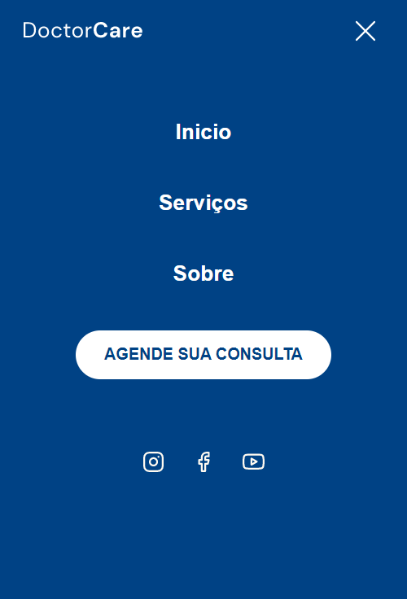

<h1 align="center">
  
</h1>

<h1 align="center">
  
</h1>

## 📱 Mobile 
<h1 align="center">
  
</h1>

## 🚀 Tecnologias

Esse projeto foi desenvolvido com as seguintes tecnologias:

- HTML
- CSS
- JavaScript
- ScrollReveal

## 💻 Projeto

 DoctorCure é uma aplicação desenvolvida durante a nlwReturn da Rocketseat, 100% responsivo (320px, 760px, 1024px+ ), utilizando o conceito mobile frist.
 No modo mobile a barra nav desaparece e vira um botão abrindo um menu que vem de baixo para cima.                                                                 
                                                                   

## 🔖 Layout
Você pode visualizar o projeto  através [desse link]( https://cleitonbarros.github.io/DoctorCare/).
